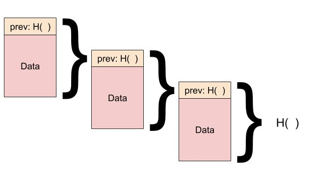

# Hash criptografico
(Digest)  

Joga um arquivo em hash criptografico e ele devolve um valor que representa justamente esse arquivo, se você alterar o arquivo o hash criptografico vai gerar um valor totalmente diferente.  
A probabilidade de colisão do hash é pequena.  

Importante notar que a função hash devolve um valor que não é possível fazer engenharia reversa nele. Isso é muito bom pois com um hash sozinho você não consegue descobrir a mensagem, apenas é bom para confirmar se aquela mensagem gera aquele hash.  

# Chaves Criptográficas
Básico de criptografia é você ter uma mensagem M, criptografar ela com a chave K e assim apenas quem possui a chave K conseguiria decifrar a mensagem.

## Chave assimétrica
Existe duas chaves (pública e privada). Se você cifrar uma mensagem com umas das chaves, apenas a chave par dela pode decifrar.  
Em outras palavras  
* Se cifrar com a **pública**, apenas a **privada** vai conseguir recuperar a informação
* Se cifrar com a **privada**, apenas a **pública** vai conseguir recuperar a informação

Para blockchain vamos apenas considerar que chave pública é para cifrar e chave privada decifrar.  

pk = public key  
sk = secret key (private key)  

# Assinatura Digital
Cifrar a mensagem com a chave privada garante que apenas quem tem a chave pública consiga decifrar. Em outras palavras, se a pessoa decifrou com a chave pública que você deu para ela, então ela sabe que só você pode ter escrito aquela mensagem.  

sig = assinatura  

Geramos o par de chaves  
`sk, pk = generateKeys(keysize);`  

Assinamos a mensagem  
`sig = sign(sk, message);`  

Verificamos se é válida se a mensagem decifrada for igual a mensagem que temos    
`isValid = verify(pk, message, sig);`  

Nessa ultima operação a gente decifra a mensagem (sign) utilizando a chave pública (pk) e depois verificamos se é igual a mensagem (message)  

# Extra
Imagine que eu e você temos os nossos pares de chaves públicas e privadas.  

Eu quero enviar dinheiro para você, para isso basta eu cifrar com sua chave pública.  
Agora única pessoa que pode recuperar o dinheiro é a pessoa que tem a chave privada par dessa chave pública, como só você tem essa chave privada, ninguém pode acessar esse dinheiro tirando você.  
(lado negativo é que se você perder essa chave privada, ninguém será capaz de acessar esse dinheiro)  

Como você sabe que fui eu que mandei esse dinheiro? Simplesmente porque eu cifrei com minha chave privada, então se você decifrar com sua chave pública, tem que devolver o conteudo correto.  

# Estrutura de Dados
Toda vez que for acrescentar dados, você calcula o hash dos dados anteriores e anexa aos dados sendo inclusos.  

  

# Perguntas  

* Quem mantêm o livro razão?
  * Os nós da rede, qualquer um que queira ligar um datacenter e ficar armazenando os blocos e processando eles.  
* Quem valida as transações?
  * Os nós da rede, você pode querer armazenar o bloco e verificar ele
* Quem cria novas moedas?
  * Quando você minera um bloco você bota mais uma transação vindo do nada para ele (se dando dinheiro do nada) mas esse dinheiro só fica na rede se as pessoas validarem o calculo dele
* Quem determina quando as regras mudam?
  * Os nós da rede, propor mudanças podem ser feitas por todos
