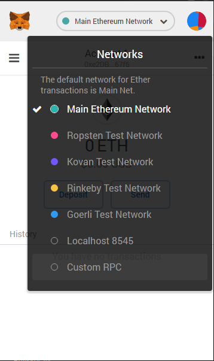
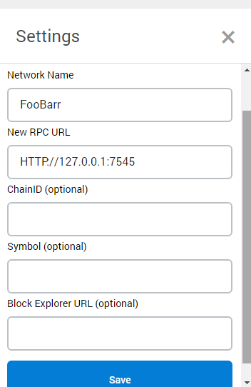
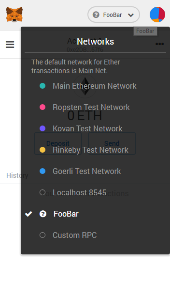

# Linkando Metamask com endereço do Ganache

Ganache > copie o link para o **RPC Server**  
  

Metamask > Altere de **Main Ethereum Network** para **Custom RPC**   
  

 Escolha um nome qualquer e bote o **RPC Server** copiado do Ganache  
  

Selecione o RPC Server que você acabou de criar    
  

Ganache > Escolha uma das contas que você deseja utilizar no Metamask  
Bote para mostrar a **chave privada**  
  

Copie a **chave privada**  
  

Metamask > Importe uma conta  
  

Bote a **chave privada** da conta do Ganache  
  

**Tenha CERTEZA que trocou a conta para essa conta do Ganache  
Você não quer fazer esses testes em uma conta real sua**  
  
