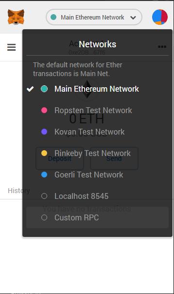
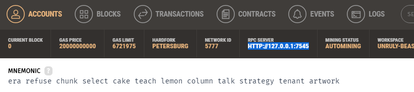
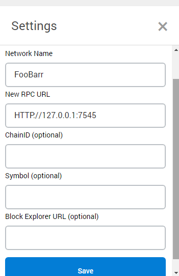
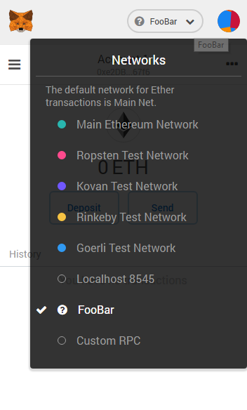
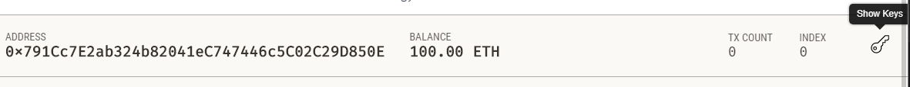
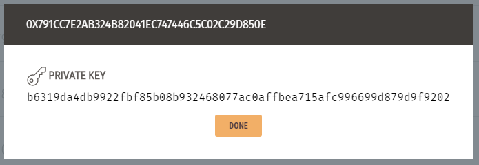
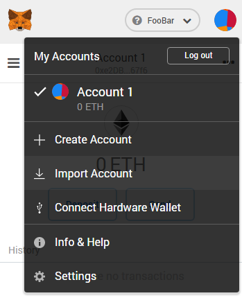
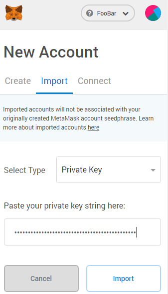
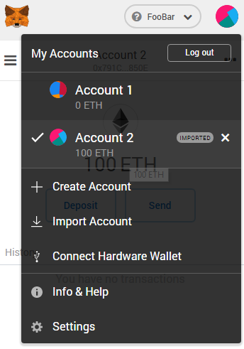

# Instalando Ganache 
**Windows 10**  
* Baixe Ganache
  * https://truffleframework.com/ganache
* Instale Ganache
  * Se o seu windows 10 não reconhecer o formato .appx
    * Abra a Microsoft Store
    * Instale App Installer

# Instalando Metamask
**Chrome**
* Instale a extensão Metamask para o Chrome
  * https://metamask.io/
* Se registre no Metamask
  * Salve em algum lugar seguro sua "Wallet Seed"
    
# Linkando Metamask com endereço do Ganache
* Abra o **Metamask**
* Altere a Network clicando em "Main Ethereum Network" (Default)  
* Selecione "Custom RPC"   
  
* Abra o **Ganache**
* Pegue o link para o RPC Server no Ganache  
  
* No **Metamask** termine de criar e salve  
  
* Selecione o seu RPC para conectar  
  
* Agora você quer botar uma dessas contas do **Ganache** no **Metamask**
* Para importar você precisa da chave privada de uma das contas
* Isso pode ser obtido no **Ganache**
* Procure a conta a qual você quer se conectar como
* Clique no simbolo da chave para exibir a chave privada  
  
* Copie essa chave privada  
  
* No **Metamask** clique na sua conta  
* Selecione importar conta  
  
* Importe com essa chave privada  
  
* Tenha **CERTEZA** que trocou a conta para essa conta do **Ganache**  
  * Você não quer fazer esses testes em uma conta real sua  
  

# Instalando Node.js
**Windows 10**
* Baixe Node.js
  * https://nodejs.org/en/
* Instale Node.js
  * "Node.js runtime" obrigatório estar selecionado para instalação
  * "Npm package manager" recomendo estar selecionado para instalação
  * "Add to PATH" recomendo estar selecionado para instalação

# Instalando Truffle
**Windows 10**
* Abra o cmd ou powershell
* Digite `npm install -g truffle`
  * Precisa no npm instalado e no adicionado no path

## Box
**Truffle** tem o conceito de Box para integrar **Truffle** com outras Frameworks
* Para instalar **Truffle** integrado com uma Framework, escolha a Framework dentro das existentes
  * https://truffleframework.com/boxes
* Chame `truffle unbox XXX`, onde XXX é o nome da framework
  * Por exemplo, para instalar **Truffle** integrado com React utilize o comando `truffle unbox react`  
* Isso vai criar um projeto no diretório corrente (de preferência vá para um vazio)

## Running
* `truffle compile`
* `truffle migrate`
* `npm run start`
  * Se não funcionar tente ir para a pasta client (`cd client`)
